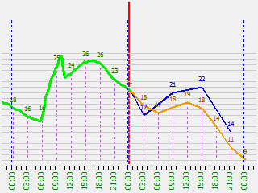

#dimeteo

##Current project condition

- [x] Electronic scheme developing
- [x] Electronic parts shopping
- [x] Recieving data from weather services
- [x] Recieving data from sensors
- [x] Storing in database
- [ ] *GUI* 
- [ ] Analizing
- [ ] Electronic Board making and solding
- [ ] Housing 3D printing
- [ ] Assembling

_First screenshot of something:_

Now working on the main part of graphical user interface. New branch **graph_comb** was created for this reason. Fresh project news will be available in the [Blog](#) section. 

##What is **dimeteo**

The idea of **dimeteo** project is to collect information about weather 
condition in the past, in the future and at the moment and to provide it in 
highly informative graphical form. 

### Weather sources
Traditional forms of weather resources provide only limited information and 
don't give a full image of weather condition:
* Weather on TV provide only forecasts only for big regions and cities
* Weather on the Internet of Mobile Apps in most cases is the same as on TV. 
Of cause there are tons of all kind of information in all possible forms, but 
it's nor for every day use. 
* Home Meteo Stations provide and collect precise information for exact 
place, but can't make a good forecast

     | in the past | at the moment | in the future
---- | ----------- | ------------- | -------------
Weather on TV | :x: | :x: | :white_check_mark:
Weather on Internet* | :x: | :white_check_mark: | :white_check_mark:
Home Meteo Station | :white_check_mark: | :white_check_mark: | :x:

**dimeteo** combines advantages of all types of weather resources! :sunglasses:

### Why comapring is important
Weather is a really subjective thing. Knowledge of the value of temperature 
gives us literally nothing, however precise it is. For example, +12 is cold 
or warm? 
* If yesterday was -3, than it's really warm 
* If yesterday was 24, it's bloody cold!
To estimate the value we need something to compare with. 

### **dimeteo** provides:
* precise current atmosphere condition (temperature, pressure and humidity)
* multiple forecast from best weather forecast services
* weather history to estimate a dynamic of changes
* showing the trend of temperature and pressure
* different kinds of LED- warnings:
	* rain
	* extreme encreasing or decreasing
	* decresing under zero
	* strong wing
	* etc.
* rich setting up: sources, units, colors, etc.  

## How it works

### Input
There are two types of information sources:
* **Sensors** - physical electronic parts connected to Raspberry Pi. They 
provide 
actual parameters of environment:
	* temperature of air (inside and outside)
	* atmospheric pressure
	* humidity

* **Weather forecast services** - provide the verity of different weather 
parameters and predictions. It's really rich source of information, although 
the weakness point is a big difference one service from another:
	* availability of your location
	* quality of prediction
	* list of parameters
	* API and type of protocol
	* price of access
In this case there is a specific module for each weather service, which 
returns normalized data for following storing and analyzing. The number of 
sources can be different and depends on personal preferences.

 
### Data storing

All data is collecting in database and using for all following functionality:
* to otput on display current weather parameters
* generating graphs'
* to analyze storing data
Combination of peices of necessary information from different sources is 
taken from database and output on display. 

### Analyzing

Soon...

### Additional features

Soon...

## Disclaimer

**dimeteo** is just for fun project. It's buildet for presonal non commercial use 
only. The author is not a professional programmer, who hopes that community 
will help to improve the code quality. Thank you :)
 

